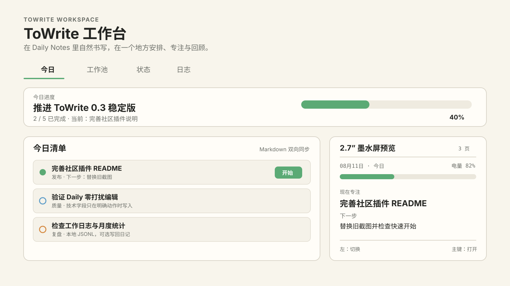

# ToWrite Open Questions

[简体中文](README.zh-CN.md) · [Releases](https://github.com/GitMorRic/towrite-open-questions/releases) · [Issues](https://github.com/GitMorRic/towrite-open-questions/issues)

ToWrite is a desktop-only Obsidian workspace for turning ordinary Markdown checkboxes, open questions, Inbox notes, and workflow notes into a calm daily plan. Markdown remains the source of truth: keep writing in Daily Notes, then use the Workbench when you want to arrange, start, complete, or review work.



## What is in 0.3

- **Today** — arrange work from your Daily Note, start one current task, track progress, and preview the 2.7-inch device layout.
- **Work Pool** — one filtered view of Markdown tasks, ToThink/ToWrite questions, Inbox notes, and workflow notes.
- **Status** — understand workflow stages, article types, open-question states, and stale notes.
- **Journal** — review completed, paused, migrated, and returned work by day or month; optionally write a summary back to your Daily Note.
- **Focus Now** — a compact pinnable window that keeps the current task visible without loading the full Work Pool.

## Three-minute setup

1. Install **ToWrite Open Questions** from Obsidian Community plugins and enable it.
2. Open **ToWrite: Settings → Daily** and choose either Obsidian Daily Notes or a fixed planning document.
3. Write normal Markdown in the configured `ToDo` section:

   ```md
   ## ToDo

   - [ ] Project
     1. [[Write release notes]]
     2. [[Test the capture flow]]
   - [ ] Later reading
     1. [[A useful paper]]
   ```

4. Click the single default Ribbon icon, or run **Open Todo Workspace** from the Command Palette.
5. Start, complete, migrate, or send a task only when you choose. Merely typing or refreshing never rewrites the Daily Note.

The checkbox parent above is treated as a category when it only contains ordinary numbered links. Real child checkboxes remain tasks. ToWrite adds a stable technical ID only when an explicit action needs one, then protects that field from accidental editing in Live Preview.

## Natural Daily Notes

ToWrite supports `[[wikilinks]]`, relative Markdown links, headings, blocks, parent categories, child tasks, and inherited targets. A task opens its own link first, otherwise the nearest linked parent, then its source block. Linked-note tasks can be projected into the Daily plan without copying their source of truth.

Unfinished work can be reviewed and migrated to the next day with a visible record left in the previous Daily Note. It is never silently rolled forward.

## Workbench surfaces

| Surface | Purpose |
| --- | --- |
| Today | Make and execute today's commitment. |
| Work Pool | Find and arrange active work across allowed Markdown sources. |
| Status | Inspect workflow coverage and open-question state. |
| Journal | Review daily/monthly transitions and time invested. |
| Focus Now | Keep one current task at the edge of attention. |
| Open Questions sidebar | Review and edit ToThink/ToWrite annotations. |

## Local-first data and networking

Markdown and readable JSON/JSONL files are the data sources of truth. Indexes are rebuildable. ToWrite does not record keystrokes or upload the full Vault.

| Feature | Default | Network/data behavior |
| --- | --- | --- |
| Daily plan, Work Pool, Journal | On/local | No network required. |
| AI provider | Off | Sends only the fields shown in the AI disclosure preview. |
| Trusted Backend | Off | Optional ranking, Skills, agents, and device coordination. |
| Device Hub / NFC | Off | Sends privacy-filtered card snapshots and opaque references. |
| External API / Capture Bridge | Off | Desktop-only local services with scoped header tokens. |

API keys and long-lived tokens use Obsidian SecretStorage on supported versions. Tokens are not placed in URLs. Review [Privacy](PRIVACY.md), [Security](SECURITY.md), and [Architecture](ARCHITECTURE.md) before enabling connected features.

## Compatibility

- Obsidian **1.11.4 or newer**
- Desktop only (`isDesktopOnly: true`)
- Release assets: `main.js`, `manifest.json`, and `styles.css`

## Troubleshooting

- **A Ribbon click does nothing:** update to the latest release, open the Command Palette, and run **Open Todo Workspace**. Current builds wait for layout restoration and show a Notice when view activation fails.
- **Today's list is empty:** verify the configured Daily Note, date format, and `ToDo` heading, then use Refresh in the Workbench.
- **A task cannot start:** open its diagnostic message. Duplicate IDs or a changed source revision are blocked to prevent writing to the wrong line.
- **Too many tasks appear:** configure Work Pool include rules and keep per-note ignore rules for legacy lists.
- **Typing feels slow:** disable unused AI/Hub/API features and report a reproducible Vault path; editor keystrokes do not scan the Vault or send network requests.

## Development

```bash
npm ci
npm test
npm run build
```

`npm run build` runs the Obsidian marketplace rule gate, TypeScript checks, production bundling, release validation, and the 2 MiB bundle limit.

## License

Version 0.3.3 and later is source-available under the [PolyForm Noncommercial License 1.0.0](LICENSE). Personal, research, educational, charitable, and other permitted noncommercial uses are allowed under those terms. Commercial use requires a separate written license from the copyright holder; see [Commercial licensing](COMMERCIAL_LICENSE.md).

Versions published before 0.3.3 remain under the license that accompanied those copies. This change does not revoke MIT rights already granted for earlier releases. Optional Backend components are distributed separately under their own licenses.
