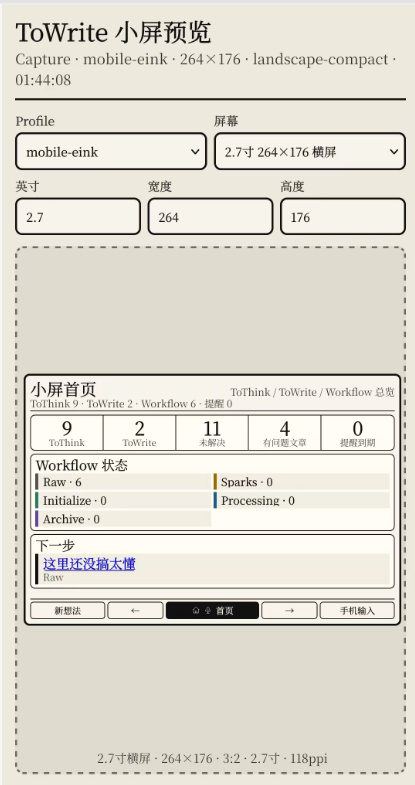
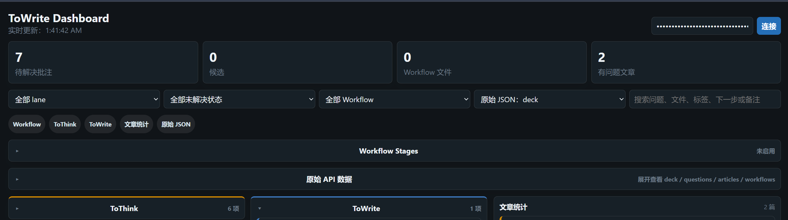

# ToWrite Open Questions

[English](README.md) | 简体中文

ToWrite Open Questions 是一个 Obsidian 桌面端插件，用来把还没想清楚、还要继续写、需要查证或需要补充的内容，保留在它们原本出现的位置旁边。

它不是普通 TODO 列表。它更像一层 `ToThink` / `ToWrite` 批注索引：正文继续保持写作流，未完成的思考和写作片段会以卡片、跳转、高亮、导出数据和可选 API 的形式浮出来。

## 主要功能

- 从 Markdown 选区、PDF 选区、显式 Markdown 规则、触发词建议创建 `ToThink` / `ToWrite` 卡片。
- 右侧栏优先显示当前笔记，并按 ToThink / ToWrite 分区；两个分区都可以整体折叠。
- 点击卡片可跳回 Markdown 原文行或 PDF 高亮位置。
- 在侧栏直接编辑卡片标题、原文正文、批注、状态、类型、lane、颜色和标签。
- 批注支持 Obsidian 风格 `[[双向链接]]`；预览里可打开已有笔记，也可创建缺失笔记。
- 选区卡片默认保存到 sidecar JSON，不污染 Markdown。只有点击“固定原文锚点”时才会写入 `^oq_xxx`。
- 编辑器原文支持整行浅色高亮，也支持单条或全局切换成“只保留左侧竖线”。
- Workflow Stages 可按文件夹、frontmatter tags 或正文 `#tag` 把 Markdown 文件分组成 Raw、Sparks、Processing 等自定义状态。
- 导出 JSON，供 dashboard、桌面小组件、脚本和墨水屏设备读取。
- 可选桌面端 External API，支持 JSON、RSS、SSE、内置 dashboard、手机小屏预览、手机 companion 输入页，以及状态、批注和新想法写回。
- 可选 OpenAI-compatible AI 摘要和本地笔记推荐；默认关闭，只在你配置接口后才会请求。

## 截图






## 为什么是桌面端插件

当前 `manifest.json` 设置为 `isDesktopOnly: true`，因为 External API 使用 Node.js `http` 在 Obsidian Desktop 内启动本地服务器。为了符合 Obsidian 社区插件审核规则，第一版市场提交按桌面端插件处理。

## 快速开始

1. 用左侧 ribbon 图标或命令面板打开 ToWrite 侧栏。
2. 在 Markdown 或 PDF 里选中文字。
3. 在浮动工具条里点击 `Think` 或 `Write`。
4. 在右侧卡片中编辑标题、批注、状态和分类。
5. 点击卡片上的箭头跳回原文。

## Markdown 触发规则

- `?? 内容` 或 `？？ 内容`：创建正式 `ToThink` 卡片，适合明确标记“这里需要想清楚”。
- `- [ ] [?] 内容`：创建待处理卡片；勾选后会被识别为 resolved。
- `> [!question]` callout：创建多行问题卡片。
- 触发词建议只处理较明确的句式，例如“分析一下”“需要确认”“来源是什么”“有没有实测”“继续写”“补写”“扩写”等。普通单问号句子不会自动变成候选，所以小说台词、对话和反问不会因为末尾是 `？` 就被标记。
- 编辑器里的候选建议只会显示加号和叉号；点加号才会保存，点叉号会忽略这一条。

## Workflow Stages

Workflow Stages 是独立于 ToThink / ToWrite 的“文件生命周期索引”。它适合把文件按项目阶段暴露给 dashboard、桌面卡片、墨水屏或后续 AI 提醒系统。

你可以在设置页开启并配置：

- `id`：稳定标识，例如 `sparks`、`processing`。
- `title` / `description`：展示标题和说明。
- `color`：dashboard 和设置页使用的颜色。
- `folderPrefixes[]`：文件夹路径前缀，例如 `MindFlow/01-Sparks`。
- `tags[]`：匹配 frontmatter tags 和正文 `#tag`。
- `limit`：每组导出多少文件。
- `staleAfterDays`：多少天没有更新后标记为 stale。

一个文件可以同时属于多个 stage。Workflow 只索引 Markdown 文件，不移动文件，也不会自动改 frontmatter。

建议把 `Stage` 当作“生命周期”，例如 Raw、Sparks、Initialize、Processing、Archive；把 MindFlow、Techbench、OCStory 这类当作“内容类型 / 项目域”。第一版可以通过文件夹前缀来表达项目域：例如 `MindFlow/01-Sparks`、`Techbench/02-Processing`、`OC-Story/Lore`。如果你想在 API 和 dashboard 里同时按“项目域 × 生命周期”交叉统计，后续可以再加独立的 `Workflow Areas` 配置，避免把 stage 复制成 `raw-mindflow`、`raw-techbench` 这种难维护的长列表。

## 数据文件

ToWrite 会在 vault 中写入可读 JSON：

```text
.obsidian-open-questions/
  index.json
  articles.json
  eink-compact.json
  workflows.json
  questions/
    <question-sidecar>.json
```

这些文件可能包含选中的笔记文本、PDF 摘录、标题、批注、标签、状态、来源路径、frontmatter 和卡片元数据。除非你明确想分享这些内容，否则不要公开导出目录。

## External API

External API 默认关闭，只在 Obsidian 桌面端运行。启用后需要 token。

默认本机地址：

```text
http://127.0.0.1:48321
```

常用接口：

```text
GET   /health
GET   /api/v1/questions
GET   /api/v1/articles
GET   /api/v1/workflows
GET   /api/v1/eink
GET   /api/v1/deck
GET   /api/v1/device-feed
GET   /api/v1/rss.xml
GET   /api/v1/events
GET   /dashboard
GET   /device
GET   /device/input
POST  /api/v1/questions/<id>/status
POST  /api/v1/questions/<id>/notes
POST  /api/v1/captures
PATCH /api/v1/questions/<id>
```

只在本机使用时保持 `127.0.0.1`。如果要给 ESP32、手机或另一台电脑访问，可以把 bind host 改成 `0.0.0.0`，但请自己用 Tailscale、Cloudflare Tunnel、反向代理、HTTPS、访问控制或防火墙保护远程访问。

### 手机小屏 / 墨水屏模拟

如果手机和电脑已经通过 Tailscale 组成局域网，在插件设置里打开 External API，把 `API bind host` 改成 `0.0.0.0`，并开启“允许 GET 查询参数 token”，然后在手机浏览器打开：

```text
http://<电脑的 Tailscale IP>:48321/device?token=<你的 token>
```

也可以在设置页的“手机/远程访问基地址”里填写 `http://<电脑的 Tailscale IP>:48321`，之后直接复制“手机小屏页面”链接。

`/device` 是小屏预览页，视觉上模拟墨水屏，支持左右滑动和屏幕上的上一页/下一页按钮。它内置屏幕模拟器，可以选择 2.7 寸、2.13 寸、4.2 寸等预设，也可以手动输入宽度、高度和英寸数；模拟屏幕会按比例居中显示。页面会请求 `GET /api/v1/device-feed`，由电脑端插件提前整理首页、Workflow 状态、下一步、ToThink/ToWrite 卡片、下一张预览和来源笔记状态。未来 ESP32、桌面小组件或其他设备也可以复用这个接口，只负责渲染。

真实墨水屏不需要负责复杂输入。卡片页会提供“回答”和“新想法”入口，打开 `/device/input` 手机 companion 页面：带 `questionId` 时默认追加到那张卡片的 note；不带 `questionId` 时可以把独立灵感写入设置里的默认 Inbox 文件、目标文件夹或 Workflow stage。手机预览页里还会额外显示“语音”按钮，可以不离开当前页面，直接用浏览器语音转文字保存为一条新想法。

手机预览页会在模拟屏幕底部显示五键提示栏：`新想法 / 上一页 / 首页+录音 / 下一页 / 手机输入或当前动作`。中间键短按回首页，长按直接语音记录新想法并写入 Device Inbox；右侧键在来源笔记页会变成“看卡片”，进入当前笔记的卡片队列。真实硬件可以把这五个提示映射到屏幕下方或侧边的实体按键。

设备协议支持 `profile=mobile-eink`、`profile=eink-bw`、`profile=desktop-card`，也支持 `page=home/cards/workflow/articles`、`cursor`、`limit`、`lane`、`stage`、`sourceFile`、`width`、`height`、`inches` 等参数。`sourceFile` 可让卡片页只刷某篇来源笔记里的 ToThink/ToWrite。`mobile-eink` 适合手机 PWA 模拟墨水屏；`eink-bw` 适合真实黑白小屏，文本更短；`desktop-card` 适合桌面小组件，信息密度更高。横屏墨水屏可以传入实际尺寸，例如 `width=264&height=176&inches=2.7`，服务端会返回 `orientation`、`aspectRatio`、`ppi` 和更紧凑的 `layout`。

卡片可以设置手动提醒时间，提醒字段会出现在 `/api/v1/questions`、`/api/v1/deck` 和 `/api/v1/device-feed` 中。`/device` 在 HTTPS 或 Tailscale Serve 等安全上下文里可以安装成 PWA；第一版提醒是在页面打开时通过 SSE 检测变化，完整后台推送需要后续 Web Push 或常驻服务支持。

详细示例见 [中文 API 文档](docs/api.zh-CN.md)。

## PDF 支持

PDF 批注是非破坏式的。ToWrite 会把 PDF 路径、选中文本、页码和归一化选区矩形保存到 sidecar JSON，然后在 Obsidian PDF 查看器中绘制 overlay 高亮。点击卡片时，会尽量跳回对应页和高亮位置。

ToWrite 不会修改 PDF 文件本体。

## AI 与本地知识推荐

AI 默认关闭。启用并配置 `baseUrl`、`apiKey`、`model` 后，ToWrite 会调用 OpenAI-compatible `/chat/completions` 接口，为已保存卡片生成摘要、下一步建议和相关本地笔记推荐。

ToWrite 不做联网搜索。它会基于 Obsidian `Vault` 和 `MetadataCache` 构建轻量本地索引，从文件名、路径、frontmatter、标签、标题和正文片段中召回候选笔记。

## 安装

### 社区插件

通过审核后，在 Obsidian 的 Community Plugins 中搜索 `ToWrite Open Questions` 安装。

### 手动安装

从 GitHub release 下载：

- `main.js`
- `manifest.json`
- `styles.css`

放到：

```text
<你的 vault>/.obsidian/plugins/towrite-open-questions/
```

重启 Obsidian，然后启用 `ToWrite Open Questions`。

如果你之前用过 `.obsidian/plugins/obsidian-towrite/` 这个早期手动安装目录，切换到市场版 id 前请先备份旧目录，尤其是其中的 `data.json`。

## 开发

```powershell
npm.cmd install
npm.cmd run test
npm.cmd run build
```

构建产物输出到 `dist/`。

## 隐私

核心索引在本地 Obsidian 内运行。External API、Workflow Stages 和 AI 都是可选功能，默认关闭。External API token 和 AI API key 保存在本地 Obsidian 插件数据中，不会写入导出的 JSON。

因为 ToWrite 会把选区文字、Workflow 文件摘要和 frontmatter 保存到 sidecar JSON 与导出文件，请把这些文件视为你的私有 vault 数据。

## License

MIT。详见 [LICENSE](LICENSE)。
